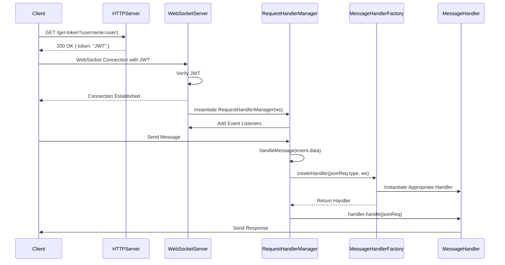

# WebSocket Server API

A WebSocket API can be very useful for real-time connection applications and chat apps. More recently, with the giant flow of apps using LLM tools, it has become unviable to use classical HTTP APIs to run those LLM services.
With that said, this code serves as a basis for developers to create their own intelligent service provider.

## How to use

### 1. Install the dependencies

```bash
npm install
```

### 2. Run the server

```bash
npm start
```

_run from the root directory_

### 3. Connect to the server

```javascript
const ws = new WebSocket("ws://localhost:8080");
```

_when in production, use the servers address_

## General structure



You can modify the `RequestHandler` class to handle the messages as you wish. Or even turn that into a factory to instantiate different handlers for different types of clients. The idea is that the handlers are responsible for the business logic of the application. They can process the messages, send messages to other clients, or even trigger events in other services like LLMs.

## Next steps

- Implement a more robust JWT verification
- Implement a more robust message handling system
- Implement an SDK that holds defined types of messages that could be shared between the client and the server
